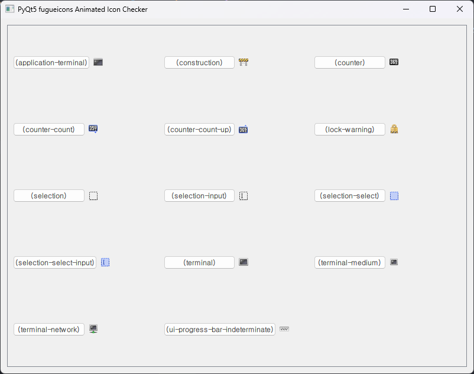

# Icons

- A repository to archive some files which are related to handle with icons from PyQt.

## ① QStyle Icons
### Use
- To use `QStyle` icons, you have to import this module:

```py
from PyQt5.QtWidgets import QStyle
```

### Screenshot

> **`pyqt5-QStyle-StandardIconChecker.py`**


### Reference
- https://doc.qt.io/qt-6/qstyle.html
- https://dev-astra.tistory.com/377

## ② `pyqt5-fugueicons` Icons

### Install
- To use icons from `pyqt5-fugueicons` Icon Package, you have to install it with below command :

```bash
> pip install pyqt5-fugueicons
```

### Use
- To use `pyqt5-fugueicons` icons, you have to import this module:

```py
import pyqt5_fugueicons as fugue
```

### Screenshots

> **`pyqt5-fugueicons-IconChecker.py`**


> **`pyqt5-fugueicons-AnimatedIconChecker`**



### Reference
- https://pypi.org/project/pyqt5-fugueicons/
- https://dev-astra.tistory.com/428