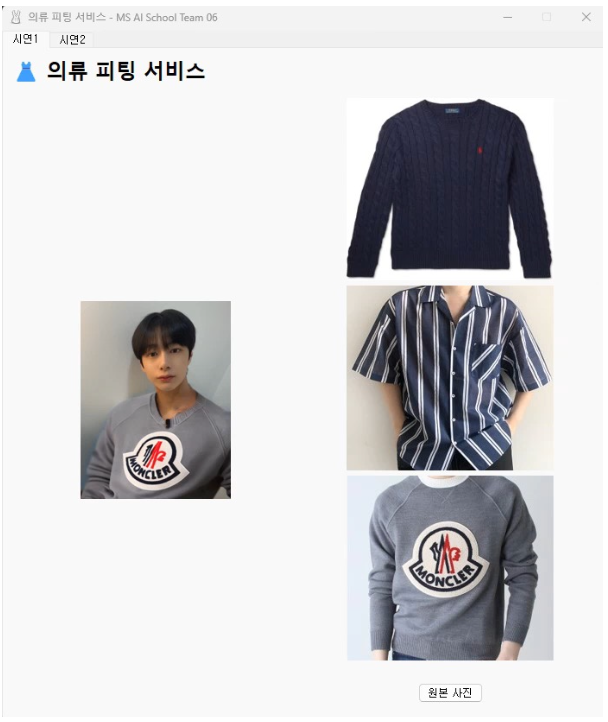

# Stable Diffusion을 이용한 의류 피팅 서비스 시연 프로그램 (PyQt)




## 프로그램 실행 방법
- 폴더 안에 있는 `pyqtapp.py` 코드를 실행합니다.

## 패키지 설치

### PyQt5

```shell
> pip install pyqt5
```

### fugueicons

```shell
> pip install pyqt5-fugueicons
```
